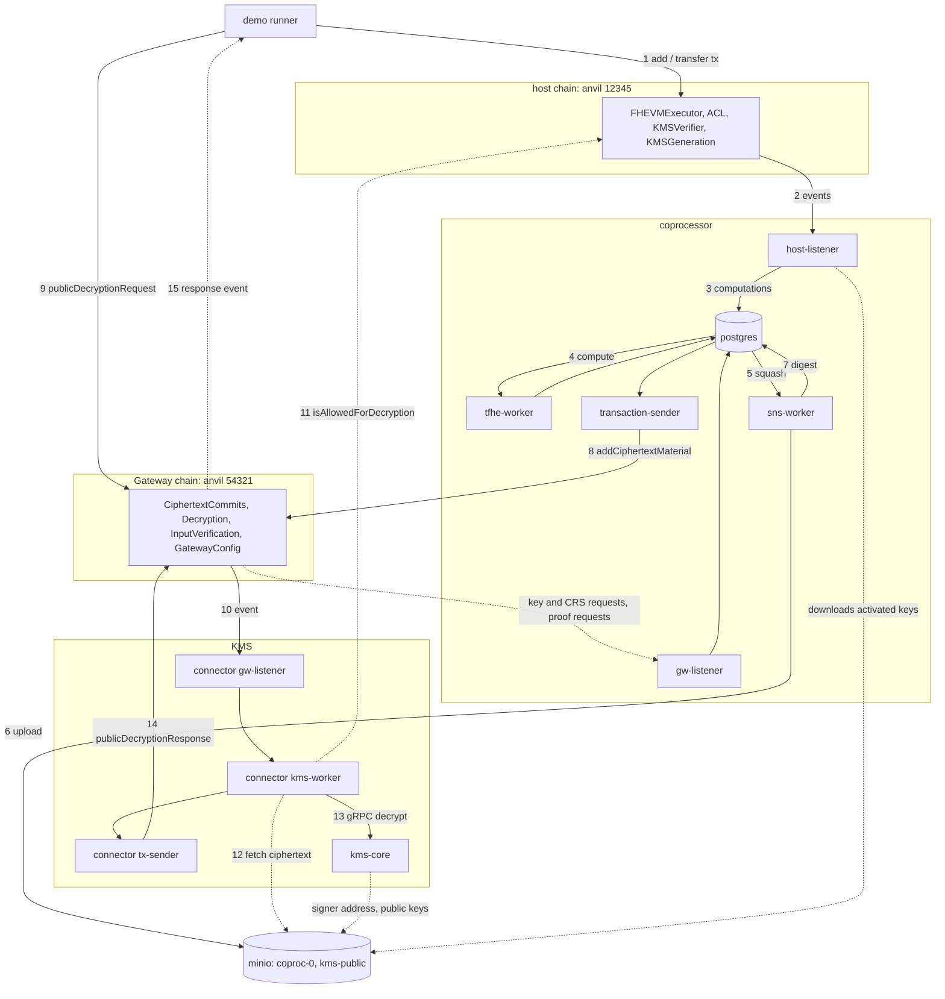

# zama-local-practice

The Zama fhevm protocol running end to end on one kind cluster, managed the way an operator
would manage it: the official Helm charts, Argo CD, monitoring, chaos experiments, a CI with
secret and image scans. Built to see what happens to one encrypted transaction, and kept as a
record of how the system was run.

A personal project, not affiliated with or endorsed by Zama. It only uses Zama's public
repositories (fhevm, kms, coprocessor-operator, all BSD-3-Clause-Clear); this repo is under
the same license, see `LICENSE`. Status: finished, not being developed further.

## Why

The protocol is spread over several repositories and several roles: contracts on the host
chain, half a dozen coprocessor services, a Gateway chain, a KMS. Reading the code does not
show what happens to one operation. Here you send `add(3, 5)` to a contract and follow it:
the listener picks up the event, a worker computes the ciphertext, it goes to a bucket, its
digest is committed on the Gateway, the KMS checks the ACL and decrypts, and 8 comes back on
chain. The diagram below is that path.

The second point is the shape. The charts are installed as the releases the operator repo
uses, every Application comes from one Argo CD root, credentials never enter git, images are
built from the upstream source at a pinned commit. The failures met on the way (a truncated
anvil state file, buckets lost to an emptyDir rollout, the memory a key activation needs, a
deploy that succeeded with the wrong fee token, 43 GB of evicted anvil states in a container
layer) are kept in the commits and the comments.

What it is not: a node that could join Zama's testnet or mainnet (coprocessors are
registered through governance), or a production template (see the stand-ins under
Architecture; the KMS is the single-node insecure build).

## What is here

- A host chain, the coprocessor (host-listener, tfhe / sns / zkproof workers, gw-listener,
  transaction-sender), a Gateway chain with its contracts, a centralized KMS and its
  connector. 16 Argo CD Applications rendered from one root, every image built from the
  upstream source at the commit in `.fhevm-ref`.
- Two on-chain checks that run as Argo CD sync hooks: an encrypted addition and a confidential
  ERC20 transfer. Both results are decrypted only by the KMS, through the Gateway; no key sits
  in the coprocessor database.
- Prometheus rules for the workers, both chains and the KMS side, a chain-progress exporter
  with its own SQL, a Grafana dashboard, and Chaos Mesh experiments (sns-worker outage, S3
  partition).

## Architecture

Everything below runs in one kind cluster. Solid arrows are the path of one encrypted
operation from the transaction to its cleartext; the numbers give the order.



Dashed arrows are lookups and key material. The three workers read and write the same
Postgres; zkproof-worker is deployed but idle, since nothing here submits inputs with proofs.

Stand-ins: Postgres in the cluster instead of RDS, minio for S3 (both on PVCs), one anvil for
the host chain and another for Zama's Gateway chain (an Arbitrum-stack chain run by Conduit),
images built locally because the upstream registry is private. Chart, values layout and
monitoring are the same as a real deployment.

## Layout

```
cluster/                      one cluster
  kind/cluster.yaml
  bootstrap/                  applied by hand, once: Argo CD install, root app, CoreDNS rewrite,
                              secrets.sh (generates secrets/generated.yaml, gitignored)
  apps/values.yaml            every Argo CD Application (argocd-apps chart values)
  infra/                      Application "infra": postgres, minio, anvil (host chain), anvil-gateway
  platform/<name>/values.yaml third-party charts: monitoring, chaos-mesh
coprocessor/                  everything specific to the coprocessor
  images/                     Dockerfiles (workers, host-listener, host-contracts) + build.sh
  workers/values.yaml         upstream chart, workers release (Application "coprocessor-workers")
  listeners/<chain>/values.yaml   upstream chart, one host-listener release per chain
  host-contracts/             contracts chart values (host deploy Job) + smoke.sh + chain-reset.sh
  gateway-contracts/values.yaml   contracts chart values (gateway deploy Job)
  gateway-host-chains/values.yaml contracts chart values (register the host chain on the Gateway)
  gateway/values.yaml         upstream chart, gateway release: gw-listener + tx-sender
  host-kms-keygen/values.yaml contracts chart Job: key + CRS generation requests on the host chain
  kms-core/                   centralized KMS core, plain manifests
  kms-connector/values.yaml   upstream chart: the KMS side's gw-listener, kms-worker, tx-sender
  sql-exporter/values.yaml    upstream exporter chart values
  chain-exporter/values.yaml  public sql_exporter chart with our own chain-progress queries
  monitoring/                 alert rules + Grafana dashboard
  demo/                       contracts + Rust runner: on-chain checks through the coprocessor (sync-hook Jobs)
  chaos/  seed/  jobs/  scripts/
```

Rules:

- One root Application (`cluster/bootstrap/root-app.yaml`) is applied by hand. It renders the
  AppProject and every other Application from `cluster/apps/values.yaml`. Adding something to
  the cluster is one entry there.
- Shared components use bare names (`infra`, `monitoring`, `chaos-mesh`); anything that belongs
  to one system carries its prefix (`coprocessor-monitoring`, `coprocessor-demo`).
- A directory is owned by Argo CD if `cluster/apps/values.yaml` points at it. `cluster/bootstrap/`
  and the chaos experiments are always applied by hand.
- The coprocessor chart is installed as several releases, the way coprocessor-operator does it:
  workers, one listener per host chain, the gateway side. Each is its own Application.
- Sync waves: 0 infra (both chains), 1 monitoring and kms-core, 2 gateway contracts Job, workers
  and exporters, 3 host contracts Job, rules and chaos, 4 host chain registration, listeners,
  gateway side and kms-connector, 5 key generation and demo. Like the upstream e2e stack: the
  KMS comes first so the contracts register its real signer, then gateway, host, registration. Application health checks are on, so a wave waits for
  the previous one.
- Every child Application carries the resources finalizer and the root prunes: removing or
  renaming an entry deletes the Application and everything it deployed.
- One-shot actions run as Jobs that record their output in the cluster: the host contracts
  deploy Job writes every address into the ConfigMap `eth-sc-addresses`, and the listener reads
  it by key. The Job stamps the version it deployed and is a no-op afterwards.
- `.fhevm-ref` is the only place the fhevm commit is typed by hand. Images are labelled with it
  and CI checks both chart sources in `cluster/apps/values.yaml` pin it.
- No credentials in git, not even practice ones. `cluster/bootstrap/secrets.sh` generates them into a
  gitignored file that `make bootstrap` applies; manifests and chart values only reference Secret
  names. Scripts get the database URL from the cluster (`cluster/bootstrap/db-url.sh`). A real
  environment would use External Secrets or SOPS instead of a generated file.

## Bring-up

Prereqs: Docker Desktop, kind, kubectl, helm, gh, make, Rust (rustup picks 1.97.1 from
`coprocessor/demo/rust-toolchain.toml`). The fhevm checkout is expected at `../zama-ai-repos/fhevm` with the
`fhevm-keys` LFS files fetched.

```bash
make up        # kind cluster, images, generated secrets + CoreDNS, Argo CD + deploy key, root app, seed
make job       # 20 ERC20 transfers through the pipeline
make watch     # counters
make demo      # on-chain checks: 3 + 5, and a confidential token transfer
make smoke     # one trivialEncrypt on the anvil chain, followed into the DB and tfhe-worker
make down
```

`FHEVM_DIR` points at the checkout if it is not next to this repo. Individual steps are the
scripts the Makefile calls. UIs: `make argocd-ui` (:8080), `make grafana` (:13000),
`make prom` (:9090); all anonymous read-only. `make alerts` prints what is firing and
`make alert-watch` keeps polling and posts a desktop notification for each new alert, since
nothing else in this setup rings. `make disk` shows where the Docker disk went, down to the
container writable layers that `docker system df` hides.

## End-to-end checks

`coprocessor/demo/` runs contracts on the anvil chain and follows their results through the
whole system: host-listener turns the events into computations, tfhe-worker computes,
sns-worker uploads the ciphertext to the bucket, transaction-sender commits its digest on the
gateway; the runner then sends a public decryption request to the gateway's `Decryption`
contract, kms-connector picks it up, checks the host ACL, fetches the ciphertext, and the KMS
answers on the gateway chain. The runner reads the answer from the `PublicDecryptionResponse`
event. Nothing outside the KMS holds a decryption key.
Two scenarios, each an Argo CD sync-hook Job of the `coprocessor-demo` application:

- `add`: `contracts/src/Add.sol` encrypts 3 and 5, adds them, allows the caller and makes
  the sum publicly decryptable, in one transaction. Prints `3 + 5 = 8`.
- `transfer`: `contracts/src/PracticeToken.sol` inherits the upstream `EncryptedERC20`
  example. Mint 1000, transfer 250, then try to transfer 900: the contract moves an
  encrypted 0 instead and the chain shows the same Transfer event either way. Balances are
  private until the practice-only `reveal` marks them publicly decryptable (the runner prints
  the ACL answer before and after); the KMS then returns 750 and 250.

```bash
coprocessor/demo/run.sh [add|transfer]   # from the laptop: forge build, port-forward both anvils, cargo run
make demo-image                          # build local/coprocessor-demo:dev (forge stage + Rust), load into kind
make demo                                # sync the coprocessor-demo app == run both Jobs, print their logs
```

Local-only shortcuts, all in the runner: the sender gives itself gas on the gateway anvil, and
the fee is paid with the mocked ZAMA token that `deployAllGatewayContractsForTests` deploys,
minted on the spot. Encrypted inputs with proofs (`transfer` with an `externalEuint64`) need
the relayer, which is not here; `transferPlain` encrypts the amount inside the contract instead.

## CI

`.github/workflows/ci.yml` runs on every push and pull request, and weekly, because the pins
do not change but the advisories do. Every action is pinned to a commit sha and every tool
image to a digest; dependabot keeps the sha pins current.

- lint: shellcheck, yamllint, actionlint, hadolint on every Dockerfile, promtool on the alert
  rules, the `.fhevm-ref` pin check, and `.github/scripts/list-images.sh --check`, which fails
  on any image reference without an exact tag or digest.
- rust: rustfmt and clippy on the demo runner.
- zizmor: audit of the workflow itself.
- secrets: trivy secret scan with the extra rules in `trivy-secret.yaml` (raw hex keys,
  mnemonic phrases), so a key pasted into a values file fails the build.
- manifests: every chart release rendered against the fhevm charts at the pinned commit and
  validated with kubeconform, plus the plain manifests.
- image scan: trivy on every third-party image that runs in the cluster, CRITICAL and fixed
  only. Accepted findings live in `.trivyignore.yaml` with a reason and an expiry date; an
  expired entry fails the weekly run. Images built here (`local/*`) and the minio images
  (quay.io refuses anonymous pulls) are pinned but not scanned.

`make lint` runs the gates that need no cluster.

## Notes

- The stress generator writes `computations` but not `dependence_chain`, so tfhe-worker sits on
  "No dcid found". `gen.sh job` runs `scripts/chains.sql` after each job to fill them in.
- The generator's CSV scenario format no longer parses (`batch_size` was added to the struct);
  use `--run-server` and POST JSON.
- zkproof-worker peaks at ~12 GB on startup while it expands the xof keyset, then settles around
  3.5 GB. Limits below that get OOMKilled.
- The S3 SDK addresses buckets as `<bucket>.<host>`; minio in-cluster needs the CoreDNS rewrite
  (with `answer auto`, otherwise glibc rejects the reply).
- Only outputs that a contract allows (ACL.allow in the same transaction) get computed and
  uploaded; the listener inserts everything else as already completed. `make smoke` therefore
  proves chain -> listener -> worker, not an upload; `make demo` covers the rest.
- The host chain is anvil with the upstream test-suite flags and mnemonic; the contracts deploy
  Job and `make smoke` use accounts derived from it. anvil keeps its state on a PVC. Without
  that a pod restart resets the chain to block 0 and the host-listener waits forever for a
  block height it already recorded.
- `BatchSpanProcessor.ExportError` in every log is the missing OTLP collector. Harmless.
